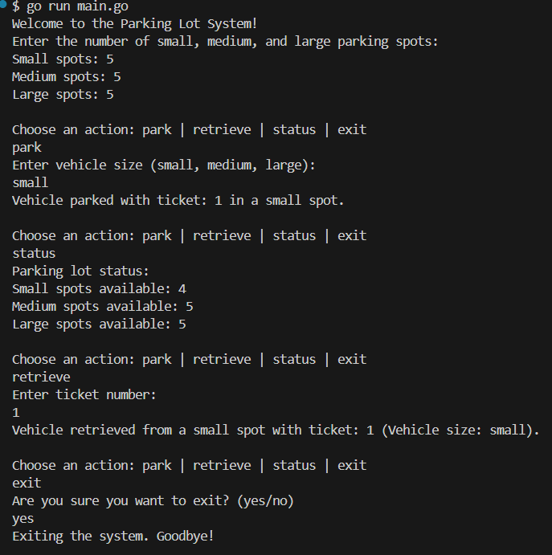

# Go Park Your Vehicle

## Overview
The Parking Lot Management System is a command-line application built in Go that allows users to park and retrieve vehicles of different sizes (small, medium, large) in a virtual parking lot. The application tracks the status of parking spots and issues tickets for parked vehicles.

### Demo

